<div align="center">
  

<div align="center">
  
  <h1>Python Number Guessing Game </h1>
  
  <p>
    <i>An Interactive Gaming Experience: From Simple <strong>Random Number Guessing</strong> To Advanced <strong>AI Solver Mode</strong>, Multi-Level Difficulty System, High Score Tracking, And Intelligent Hint Generation.</i>
  </p>

  <p>
    <a href="#-about-the-project">About</a> •
    <a href="#-tech-stack--tools">Tech Stack</a> •
    <a href="#-gallery--demo">Gallery</a> •
    <a href="#-features--evolution">Evolution</a> •
    <a href="#-installation--usage">How To Run</a> •
    <a href="#-warnings--troubleshooting">Warnings</a>
  </p>
</div>

<br>

<br>

<h2 align="center" id="-about-the-project">About The Project </h2>

<div align="center">
  <p>
    <i>This Repository Represents The <strong>Fourth Major Milestone</strong> In My <strong>Front-End Diploma (Programming Fundamentals Track)</strong>.</i>
  </p>
  <p>
    <i>It's More Than Just A Game, It's A Documentation Of My Journey In <strong>Game Development & Algorithm Design</strong>. The Project Chronicles The Evolution From Simple Random Number Generation Using <strong>Basic Input/Output</strong> To A Sophisticated Gaming System Powered By <strong>Object-Oriented Programming</strong> And <strong>Binary Search AI</strong>.</i>
  </p>
  <p>
    <i>The Final Version Is An Intelligent Game That Features Two Distinct Modes: <strong>Player vs PC</strong> Where Users Try To Guess The Computer's Number Across Three Difficulty Levels, And <strong>AI Solver Mode</strong> Where An Artificial Intelligence Uses Binary Search Algorithm To Guess Your Number With Maximum Efficiency. The System Includes <strong>Persistent High Score Tracking</strong>, Smart Mathematical Hints, And A Professional Menu-Driven Interface.</i>
  </p>
</div>

<br>

<br>

<h2 align="center" id="-tech-stack--tools">Tech Stack & Tools </h2>

<div align="center">
  
  
  
  
  
</div>

<br>

<div align="center">
  <p>
    • <strong>Python (3.10+):</strong> <i>The Core Language Driving All Game Logic, Random Number Generation, And File Management Operations.</i><br>
    • <strong>Object-Oriented Programming:</strong> <i>Utilizes Class-Based Architecture With Methods For Game Modes, Score Management, And Hint Generation.</i><br>
    • <strong>Random & Math Modules:</strong> <i>Implements Random Number Generation For Game Mechanics And Mathematical Functions For Prime Number Detection.</i><br>
    • <strong>Binary Search Algorithm:</strong> <i>Powers The AI Solver Mode With Optimal Guessing Strategy, Minimizing Attempts Through Smart Divide-And-Conquer Approach.</i><br>
    • <strong>File I/O Operations:</strong> <i>Manages Persistent High Score Storage Using Text Files, Ensuring Records Survive Across Multiple Gaming Sessions.</i><br>
    • <strong>Miro:</strong> <i>Used For Planning And Designing The Game Flow, Logic Flowcharts, And Algorithm Structure Before Writing Any Code.</i>
  </p>
</div>

<br>

<br>

<h2 align="center" id="-gallery--demo">Gallery & Demo </h2>

<div align="center">
  <i>The Project Followed A Structured "Plan-Then-Code" Approach - Below Is The Comparison Between The Planning Phase And The Final Execution For Both Versions.</i>
</div>
<br>

<table align="center" width="100%">
  <tr>
    <th style="text-align: center;" width="50%">Basic Version</th>
    <th style="text-align: center;" width="50%">Advanced Version</th>
  </tr>
  
  <tr>
    <td align="center">
      <strong>Planning (Logic)</strong><br><br>
      
    </td>
    <td align="center">
      <strong>Planning (Logic)</strong><br><br>
      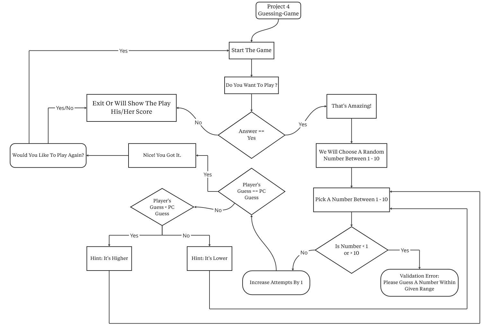
    </td>
  </tr>

  <tr>
    <td align="center" valign="top">
      <strong>Execution (Main Result)</strong><br><br>
      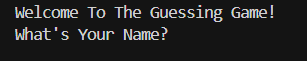
    </td>
    <td align="center" valign="top">
      <strong>Execution (Main Result)</strong><br><br>
      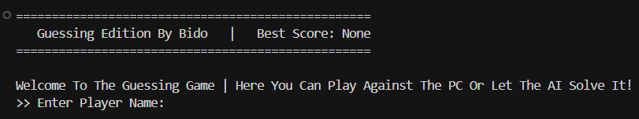
    </td>
  </tr>
</table>

<br>

<div align="center">
<details>
  <summary style="font-size: 1.2em; font-weight: bold; cursor: pointer;">View More Screenshots (Click Here) </summary>
  <br>
  
  <h3>Basic Version - Extra Shots</h3>
  <table align="center" width="100%">
    <tr>
      <td align="center" valign="middle" width="50%">
        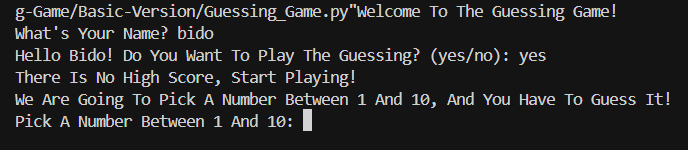
      </td>
      <td align="center" valign="middle" width="50%">
        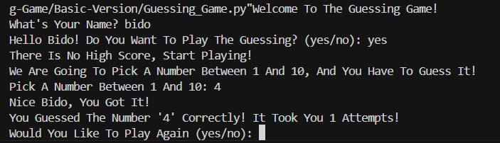
      </td>
    </tr>
  </table>
  
  <br>
  
  <table align="center" width="100%">
    <tr>
      <td align="center" valign="middle" width="50%">
        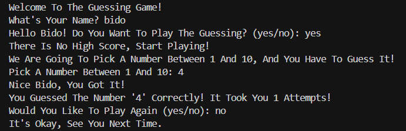
      </td>
      <td align="center" valign="middle" width="50%">
        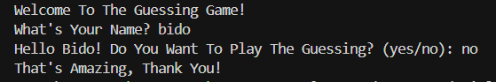
      </td>
    </tr>
  </table>
  
  <br><br><hr><br>
  
  <h3>Advanced Version - Extra Shots</h3>
  <table align="center" width="100%">
    <tr>
      <td align="center" valign="middle" width="50%">
        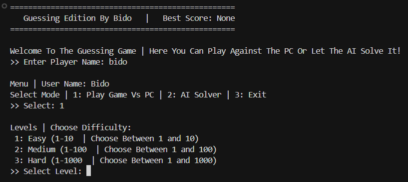
      </td>
      <td align="center" valign="middle" width="50%">
        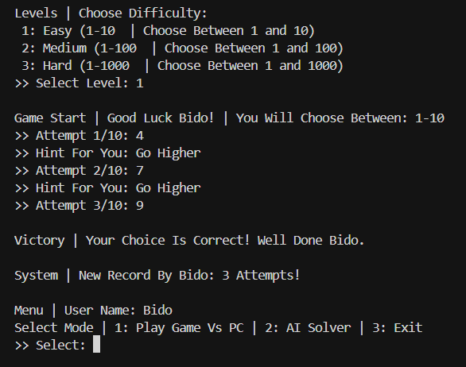
      </td>
    </tr>
  </table>
  
  <br>
  
  <table align="center" width="100%">
    <tr>
      <td align="center" valign="middle" width="50%">
        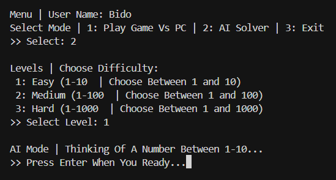
      </td>
      <td align="center" valign="middle" width="50%">
        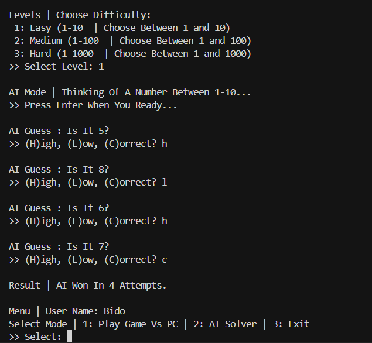
      </td>
    </tr>
  </table>
  
  <br>
  
  <table align="center" width="100%">
    <tr>
      <td align="center" valign="middle" width="50%">
        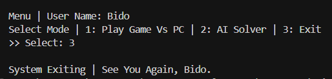
      </td>
      <td align="center" valign="middle" width="50%">
        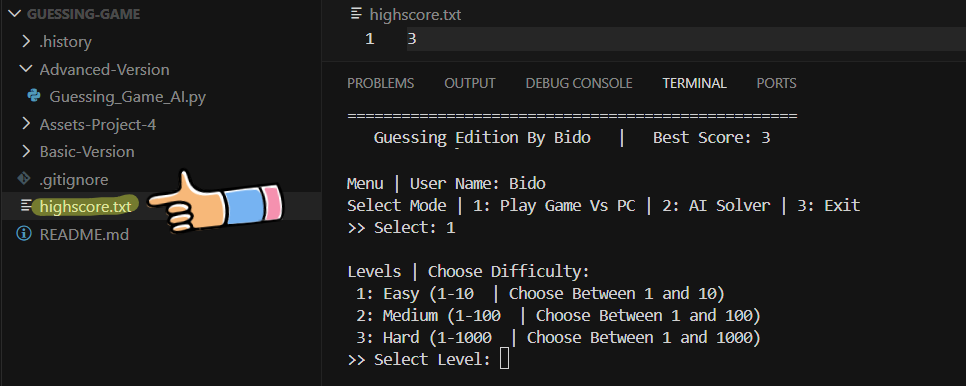
      </td>
    </tr>
  </table>
  
</details>
</div>

<br>

<div align="center">
  <h3>Live Demo </h3>
  <p><i>Watch The Game In Action: Playing Both Modes With Different Difficulty Levels And AI Solving Strategy.</i></p>
  
  <a href="https://drive.google.com/file/d/1dk4s-jGQuuzSVySLVbjdWKhS_7UJJri5/view?usp=sharing" target="_blank">
    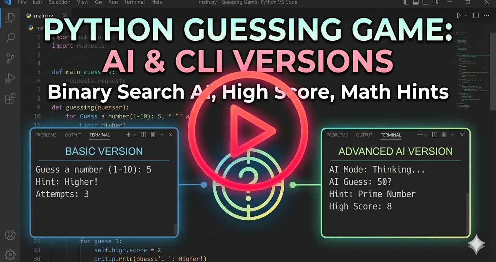
    <br>
    <em>Click To Watch Video ▷</em>
  </a>
</div>

<br>

<br>

<h2 align="center" id="-features--evolution">Features & Evolution </h2>

<div align="center">
<i>The Transition From The Basic Single-Mode Game To The Advanced Dual-Mode System Highlights A Significant Leap In Algorithmic Complexity And Gaming Experience.</i>
</div>
<br>

<table align="center" style="border-collapse: collapse; width: 85%;">
  <thead>
    <tr>
      <th align="center" style="border: 1px solid #ddd; padding: 12px; text-align: center;"><strong>Feature</strong></th>
      <th align="center" style="border: 1px solid #ddd; padding: 12px; text-align: center;"><strong>Basic Version</strong></th>
      <th align="center" style="border: 1px solid #ddd; padding: 12px; text-align: center;"><strong>Advanced Version (AI-Ready)</strong></th>
    </tr>
  </thead>
  <tbody>
    <tr>
      <td align="center" style="border: 1px solid #ddd; padding: 10px;"><strong>Game Modes</strong></td>
      <td align="center" style="border: 1px solid #ddd; padding: 10px;">Single Mode (Player Guesses)</td>
      <td align="center" style="border: 1px solid #ddd; padding: 10px;"><strong>Dual Mode</strong> (Player + AI Solver)</td>
    </tr>
    <tr>
      <td align="center" style="border: 1px solid #ddd; padding: 10px;"><strong>Difficulty Levels</strong></td>
      <td align="center" style="border: 1px solid #ddd; padding: 10px;">Fixed Range (1-10)</td>
      <td align="center" style="border: 1px solid #ddd; padding: 10px;"><strong>3 Levels</strong> (Easy/Medium/Hard)</td>
    </tr>
    <tr>
      <td align="center" style="border: 1px solid #ddd; padding: 10px;"><strong>Score System</strong></td>
      <td align="center" style="border: 1px solid #ddd; padding: 10px;">Session-Based Tracking</td>
      <td align="center" style="border: 1px solid #ddd; padding: 10px;"><strong>Persistent High Score</strong> (File Storage)</td>
    </tr>
    <tr>
      <td align="center" style="border: 1px solid #ddd; padding: 10px;"><strong>Hint System</strong></td>
      <td align="center" style="border: 1px solid #ddd; padding: 10px;">Basic Higher/Lower Hints</td>
      <td align="center" style="border: 1px solid #ddd; padding: 10px;"><strong>Mathematical Properties</strong> & Prime Detection</td>
    </tr>
    <tr>
      <td align="center" style="border: 1px solid #ddd; padding: 10px;"><strong>Code Structure</strong></td>
      <td align="center" style="border: 1px solid #ddd; padding: 10px;">Procedural Programming</td>
      <td align="center" style="border: 1px solid #ddd; padding: 10px;"><strong>Object-Oriented</strong> (Class-Based)</td>
    </tr>
    <tr>
      <td align="center" style="border: 1px solid #ddd; padding: 10px;"><strong>AI Intelligence</strong></td>
      <td align="center" style="border: 1px solid #ddd; padding: 10px;">No AI Features</td>
      <td align="center" style="border: 1px solid #ddd; padding: 10px;"><strong>Binary Search Algorithm</strong></td>
    </tr>
  </tbody>
</table>

<br>

<div align="center">
  <h3>Key Features In Advanced Version </h3>
  <p>
    • <i><strong>Dual Game Modes:</strong> Play As A <strong>Human Player</strong> Trying To Guess The Computer's Number, Or Watch The <strong>AI Solver</strong> Use Binary Search To Guess Your Number With Maximum Efficiency.</i><br>
    • <i><strong>Three Difficulty Levels:</strong> Choose Between <strong>Easy (1-10)</strong>, <strong>Medium (1-100)</strong>, Or <strong>Hard (1-1000)</strong> With Different Attempt Limits For Each Level.</i><br>
    • <i><strong>Persistent High Score System:</strong> The Game Automatically Tracks And Saves Your Best Performance To <strong>highscore.txt</strong> File, Challenging You To Beat Your Previous Records.</i><br>
    • <i><strong>Smart Mathematical Hints:</strong> Receive Intelligent Clues Based On Number Properties Including <strong>Divisibility Rules</strong> And <strong>Prime Number Detection</strong> When You Reach Mid-Game.</i><br>
    • <i><strong>Binary Search AI:</strong> The AI Solver Mode Demonstrates Computer Science Algorithms In Action, Using <strong>Divide-And-Conquer Strategy</strong> To Find Any Number With Optimal Speed.</i><br>
    • <i><strong>Professional Menu System:</strong> Navigate Through A Clean, Menu-Driven Interface With <strong>Screen Clearing</strong>, Player Name Tracking, And Real-Time Score Display.</i>
  </p>
</div>

<br>

<br>

<h2 align="center" id="-installation--usage">Installation & Usage </h2>

<div align="center">
  <i>Follow The Steps Below To Run The Project Locally On Your Machine - Ensure You Have <strong>Python 3.10+</strong> Installed.</i>
</div>

<br>

<div align="center">
  <h3>1️⃣ Clone The Repository</h3>
  <i>Open Your Terminal And Run The Following Command To Download The Project Files:</i>
</div>

```bash
git clone https://github.com/hexbido/Number-Guessing-Game.git
cd Number-Guessing-Game
```

<br>

<div align="center">
  <h3>2️⃣ No External Dependencies Required</h3>
  <i>This Project Uses Only Python's Built-In Libraries (random, math, os, time). No Additional Packages Need To Be Installed!</i>
</div>

<br>

<div align="center">
  <h3>3️⃣ Run The Basic Version</h3>
  <i>Navigate To The Basic Version Folder And Execute The Simple Guessing Game:</i> 
</div>

```bash
cd Basic-Version
python Guessing_Game.py
```

<br>

<div align="center">
  <h3>4️⃣ Run The Advanced Version (AI + OOP)</h3>
  <i>To Launch The Full Game With AI Solver Mode And Multi-Level System:</i> 
</div>

```bash
cd Advanced-Version
python Guessing_Game_AI.py
```

<br>

<div align="center">
  <h3>5️⃣ Game Instructions</h3>
  <i>Follow These Steps To Play The Game Successfully:</i>
</div>

<div align="center">
  <p>
    • <strong>Player Mode:</strong> <i>Select Mode 1, Choose Your Difficulty Level, And Try To Guess The Computer's Secret Number Within The Allowed Attempts.</i><br>
    • <strong>AI Solver Mode:</strong> <i>Select Mode 2, Think Of A Number, And Guide The AI By Responding With (H)igh, (L)ow, Or (C)orrect To Its Guesses.</i><br>
    • <strong>Using Hints:</strong> <i>In Player Mode, You'll Receive Basic Direction Hints And A Smart Mathematical Hint At The Halfway Point.</i><br>
    • <strong>High Score:</strong> <i>Your Best Performance Is Automatically Saved - Beat Your Record By Completing The Game In Fewer Attempts!</i>
  </p>
</div>

<br>

<br>

<h2 align="center" id="-warnings--troubleshooting">Warnings & Troubleshooting </h2>

<div align="center">
  <p><i>Please Review The Following Notes To Ensure Smooth Operation And Avoid Common Issues:</i></p>
  
  <p>
    • <strong>Input Validation:</strong> <i>The Game Expects Numeric Inputs For Guessing - Entering Text Or Special Characters Will Be Ignored Or Prompt Re-Entry.</i><br><br>
    • <strong>File Permissions:</strong> <i>Ensure The Application Has Write Permissions In Its Directory To Create And Modify The <strong>highscore.txt</strong> File For Score Tracking.</i><br><br>
    • <strong>Screen Clearing:</strong> <i>The Advanced Version Uses OS-Specific Commands To Clear The Screen - This Feature Works On Windows (cls) And Unix/Mac (clear) Systems.</i><br><br>
    • <strong>AI Solver Honesty:</strong> <i>When Using AI Solver Mode, Provide Accurate Feedback (H/L/C) To The AI's Guesses - Incorrect Responses Will Cause The Algorithm To Fail.</i><br><br>
    • <strong>High Score Reset:</strong> <i>To Reset Your High Score, Simply Delete The <strong>highscore.txt</strong> File - A New Record Will Be Created On The Next Game.</i><br><br>
    • <strong>Number Range:</strong> <i>When Selecting Difficulty Levels, Pay Attention To The Range Limits - Guessing Outside The Valid Range Will Not Count As An Attempt.</i><br><br>
    • <strong>Mathematical Hints:</strong> <i>The Smart Hint System Analyzes Number Properties - If Your Secret Number Has No Distinct Mathematical Properties, The Hint May Be Generic.</i>
  </p>
</div>

<br>

<div align="center">
  <p><i>Made With  By <a href="https://github.com/hexbido">B I D O</a></i></p>
</div>

